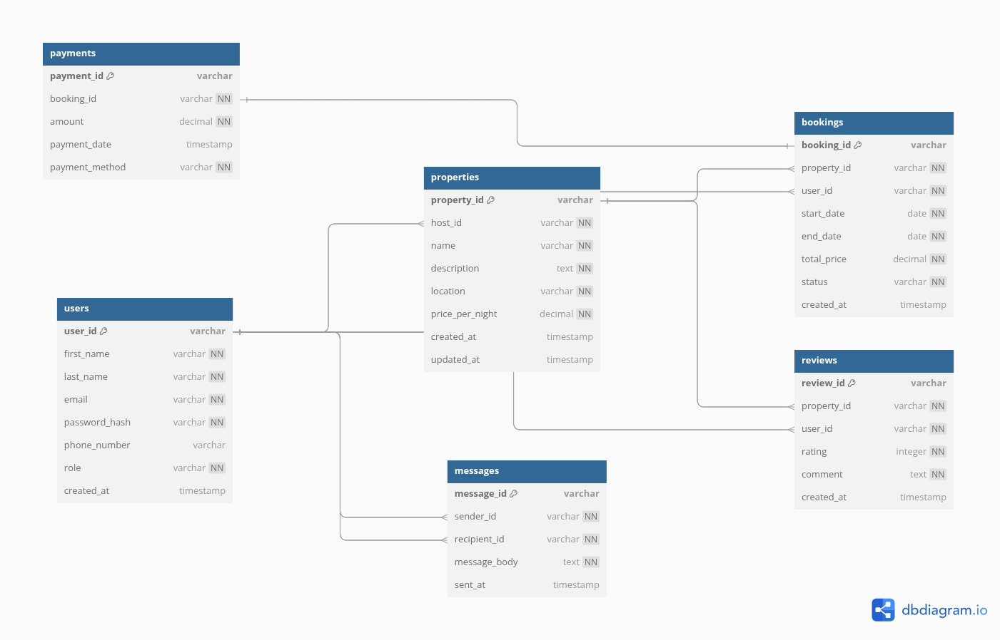

# ENTITY RELATIONSHIP (ER) DIAGRAM

The ER diagram can be found [here](https://dbdiagram.io/d/airbnb-erd-68610c8cf413ba35085e3cf4).



```
// Use DBML to define your database structure
// Docs: https://dbml.dbdiagram.io/docs

Table users {
  user_id varchar [primary key, note: 'UUID']
  first_name varchar [not null]
  last_name varchar [not null]
  email varchar [unique, not null]
  password_hash varchar [not null]
  phone_number varchar [null]
  role varchar [not null, note: 'guest, host, admin']
  created_at timestamp [default: CURRENT_TIMESTAMP]

  Indexes {
    user_id [pk]
    email [unique]
  }
}

Table properties {
  property_id varchar [primary key, note: 'UUID']
  host_id varchar [not null]
  name varchar [not null]
  description text [not null]
  location varchar [not null]
  price_per_night decimal [not null]
  created_at timestamp [default: CURRENT_TIMESTAMP]
  updated_at timestamp [note: 'ON UPDATE CURRENT_TIMESTAMP']

  Indexes {
    property_id [pk]
    host_id
  }
}

Table bookings {
  booking_id varchar [primary key, note: 'UUID']
  property_id varchar [not null]
  user_id varchar [not null]
  start_date date [not null]
  end_date date [not null]
  total_price decimal [not null]
  status varchar [not null, note: 'pending, confirmed, canceled']
  created_at timestamp [default: CURRENT_TIMESTAMP]

  Indexes {
    booking_id [pk]
    property_id
    user_id
  }
}

Table payments {
  payment_id varchar [primary key, note: 'UUID']
  booking_id varchar [not null]
  amount decimal [not null]
  payment_date timestamp [default: CURRENT_TIMESTAMP]
  payment_method varchar [not null, note: 'credit_card, paypal, stripe']

  Indexes {
    payment_id [pk]
    booking_id
  }
}

Table reviews {
  review_id varchar [primary key, note: 'UUID']
  property_id varchar [not null]
  user_id varchar [not null]
  rating integer [not null, note: 'CHECK: rating >= 1 AND rating <= 5']
  comment text [not null]
  created_at timestamp [default: CURRENT_TIMESTAMP]

  Indexes {
    review_id [pk]
    property_id
    user_id
  }
}

Table messages {
  message_id varchar [primary key, note: 'UUID']
  sender_id varchar [not null]
  recipient_id varchar [not null]
  message_body text [not null]
  sent_at timestamp [default: CURRENT_TIMESTAMP]

  Indexes {
    message_id [pk]
    sender_id
    recipient_id
  }
}

// Relationships
Ref: properties.host_id > users.user_id // many-to-one (host owns properties)

Ref: bookings.property_id > properties.property_id // many-to-one (bookings for property)

Ref: bookings.user_id > users.user_id // many-to-one (user makes bookings)

Ref: payments.booking_id - bookings.booking_id // one-to-one (payment for booking)

Ref: reviews.property_id > properties.property_id // many-to-one (reviews for property)

Ref: reviews.user_id > users.user_id // many-to-one (user writes reviews)

Ref: messages.sender_id > users.user_id // many-to-one (user sends messages)

Ref: messages.recipient_id > users.user_id // many-to-one (user receives messages)
```